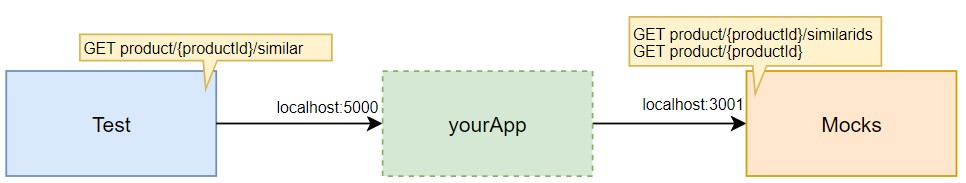
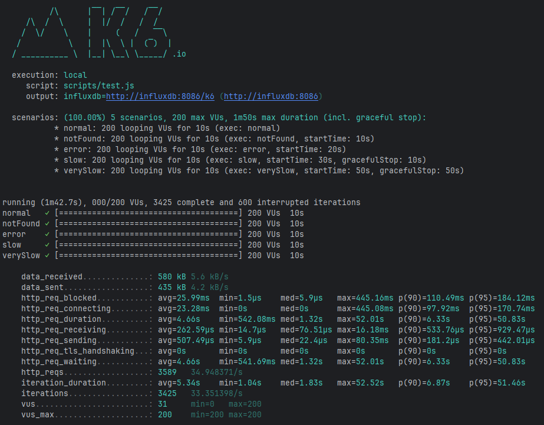
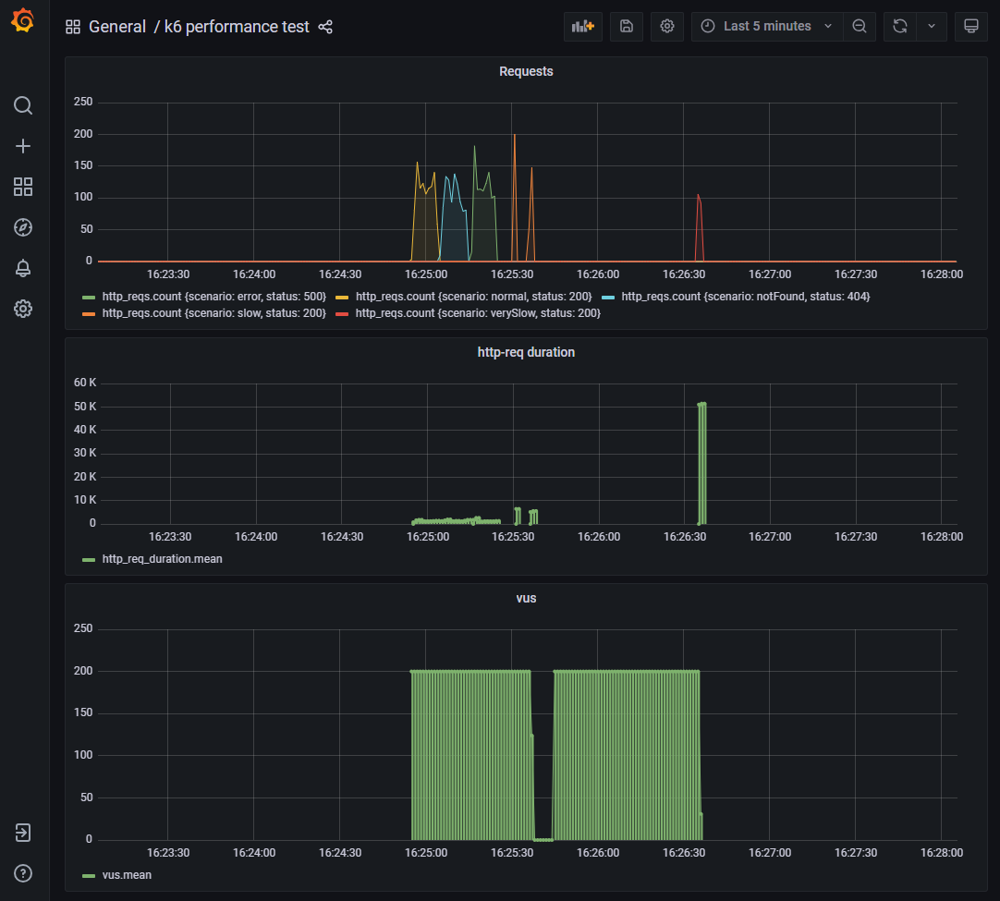

# 📦 Similar Product Service -- Backend-dev-test-inditex

**Spring Boot 4 + Spring Framework 7 + Reactor**

## ❓ Problem description

This service exposes a REST endpoint that returns the detailed information
of products similar to a given one, aggregating data from two external APIs:
one providing similar product IDs and another providing product details.

## 🧱 Architecture

The application follows **Hexagonal Architecture** (Ports & Adapters), with a simple vertical slicing at the use case level,
sufficient to organize the functionality without overloading the solution, maintaining shared domain and infrastructure to avoid duplication,
which allows for decoupled, testable, and easily extensible code:

- **Domain**: business logic and core models
- **Application**: use cases acting as facades
- **Infrastructure**: external APIs integrations via WebClient
- **API**: REST adapters generated using **OpenAPI** (**API First**)

## 🏗️ Design patterns

- **Facade**: use cases encapsulate orchestration logic
- **Adapter**: external APIs integrations
- **Data Mapper**: separation between domain and API models

## 🔹 API First approach

The REST API contract is defined using **OpenAPI** (similarProducts.yaml).
Controllers implement the generated interfaces, ensuring contract compliance
and enabling early validation with frontend teams.

## ⚡ Reactive programming

The application is implemented with **Spring WebFlux**, as the use case is entirely **I/O-bound** and relies on external HTTP calls.
**Reactive** flows enable efficient composition, **non-blocking execution**, and centralized error handling.

## 🧩 Mapping Strategy

Manual mapping is used between domain and API models as transformations are
straightforward and do not justify additional mapping frameworks.

## 🚨 Error handling

- Product not found → 404 Not Found
- External API failure / timeout → 500 Internal Server Error

In **WebFlux**, errors are propagated as **reactive** signals and handled centrally
using @RestControllerAdvice, ensuring consistent error responses.

## 🧪 Testing strategy

- **Unit tests**: controller tests using WebFluxTest with mocked use cases
- **Integration tests**: full context tests validating HTTP status codes and error propagation
- Error scenarios covered: 404, 500

Tests validate both happy paths and failure scenarios.

## ▶️ Running the application

### 📋 Requirements
- Java 17+
- Maven 3.9+
- Docker

### 🛠️ Run locally
- mvn spring-boot:run
- For functional validation, the service can be tested directly using curl or Postman

The service will be available at:
http://localhost:5000/product/{productId}/similar

### 🛠️ Set up and run k6 performance test
- Enable file sharing for the **shared** folder on your docker dashboard -> settings -> resources -> file sharing
- Start the mocks and other needed infrastructure with the following command:
    - docker-compose up -d simulado influxdb grafana
    - Check that mocks are working with a sample request to http://localhost:3001/product/1/similarids.
- Execute the test run with the following command:
    - docker-compose run --rm k6 run scripts/test.js
    - Browse http://localhost:3000/d/Le2Ku9NMk/k6-performance-test to view the results

### 📈 Example of k6 Execution

### 📈 Metrics in Grafana

## 🚨 Problems encountered

- The verySlow scenario of k6 does not display the data correctly in grafana when it ends prematurely.
- With a reactive implementation using Flux, when catching exceptions and returning an ErrorResponse object in the ResponseEntity,
  the k6 tests become devirtualize due to the large number of responses with status 0, so I return a Void in the ResponseEntity.
- With reactive processing, the controller needs to convert the fluxes to a product list Mono to return the OK response
  once all have been processed. Otherwise, the 500 integration test will return OK because the flux is still running.
- Although the model doesn't use JsonNullable, the OpenAPI Generator adds nullability support imports globally.
  That's why I've included jackson-databind-nullable, which is an official dependency of the generator.
- Spring Framework 7 adopts JSpecify as the nullability standard. Reactor requires non-nullable types in publishers,
  so I use @NonNull to define explicit contracts and avoid compile-time ambiguity.
- In Spring Boot 4, WebClient.Builder no longer exposes itself as a global bean,
  so I define it explicitly to have full control over its configuration and avoid implicit framework dependencies.

## 🚀 Possible improvements

- Increased gracefulStop to 50s to display data correctly in Grafana for the **verySlow scenario** of k6
- Return an object ErrorResponse in the ResponseEntity with error details
- Use a **Strategy** pattern so that, based on a profile or property, resilience is implemented for 404 errors
  and to prevent the flow from being broken, although this would cause the k6 tests not to show 404 errors
- Use **MapStruct** if there were transformation logic, nested structures, complex lists, or multiple DTOs with different rules.
- Add observability (metrics and tracing)
- Add contract tests against OpenAPI
- Add future integration with **Resilience4j** (Retry and CircuitBreaker)
- Add caching for product details

## 📝 Final notes

This solution prioritizes clarity, testability, and maintainability over
premature optimization or unnecessary complexity.